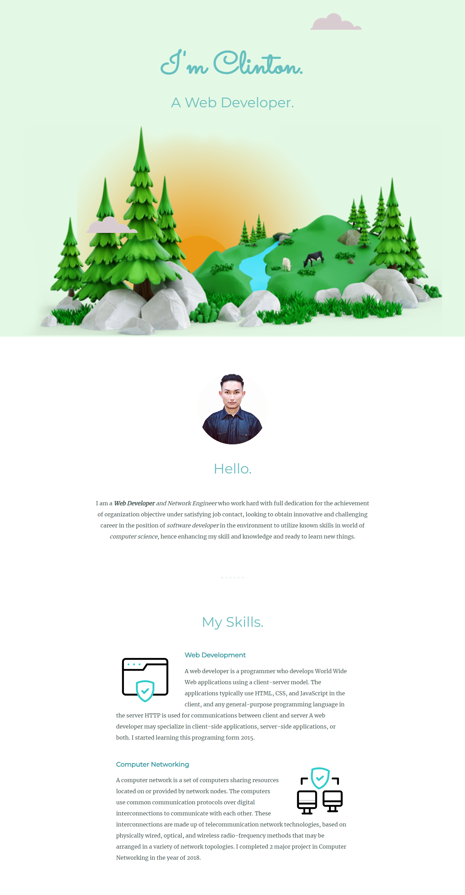

# 🌟 Welcome to My Profile Website! 🌟

### Check it out here: [oinamclintonsingh.github.io/profile](https://oinamclintonsingh.github.io/profile/)

---

## 👋 Hello, I'm Oinam Clinton Singh!

I'm thrilled to have you visit my personal profile website. This is your one-stop destination to know more about me, my projects, and my journey in the tech world.

---

## 🚀 About Me

I'm a passionate developer with a love for creating innovative solutions and exploring new technologies. Whether it's front-end design, back-end development, or anything in between, I'm always up for the challenge.

### 💼 Professional Experience

- **Role**: Network Engineer
- **Company**: Movate
- **Experience**: ! Year and 9 months 

### 🎓 Education

- **Degree**: B-Tech
- **Institution**: Mizoram University
- **Year**: 2019

### 🌱 Skills

- **Languages**: JavaScript, HTML, CSS.
- **Frameworks**: React, Node.js.
- **Tools**: Git, GitHub.

---

## 📂 Projects

Explore some of my most exciting projects:

### PortalEra
- **Description**: PortalEra is a professional website design and development company dedicated to creating impactful digital experiences.
- **Technologies Used**: JavaScript, HTML, CSS.
- **Link**: https://www.portalera.com/

### [Project 2 Name]
- **Description**: A brief description of the project.
- **Technologies Used**: JavaScript, HTML, CSS, [Other Technologies]
- **Link**: [Project Link]

---

## 📫 Connect with Me

I'm always eager to connect with like-minded individuals and explore new opportunities. Feel free to reach out to me!

- **Email**: oinamclinton.co@gmail.com
- **GitHub**: https://github.com/oinamclintonsingh

---

## 🌟 Fun Facts

- **Hobbies**: Coding, Hiking.

---

Thank you for visiting my profile! I hope you enjoy exploring my work and learning more about me.

